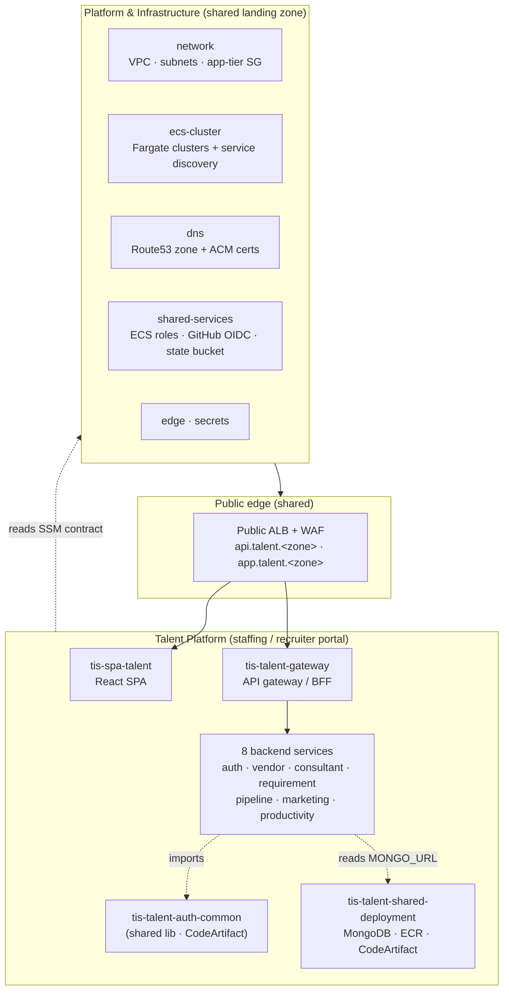

# Transcend IT Solutions — Engineering

A multi-tenant, AWS-native platform. Portals are built as independent
microservice repos that sit on one shared cloud landing zone. This page groups
the repositories by role so you can navigate the architecture instead of a flat
list.

---

## Architecture at a glance

Every application repo reads the shared platform's published **SSM contract**
(`/tis-platform/<env>/*`) — it never modifies the shared stacks. Tenancy is
pooled multi-tenant: the tenant travels in the JWT `tid` claim, isolation is
logical.

---

## 🏗️ Platform & Infrastructure

The shared, application-agnostic landing zone every portal deploys onto. Apply
these first (in order); they publish outputs to SSM Parameter Store that all
portals consume.

| Repo | Role |
| --- | --- |
| [`tis-shared-services-deployment`](https://github.com/Transcend-IT-Solutions/tis-shared-services-deployment) | Remote-state bucket, baseline ECS roles, GitHub OIDC deploy role |
| [`tis-network-deployment`](https://github.com/Transcend-IT-Solutions/tis-network-deployment) | One shared VPC — public / app / data tiers, shared app-tier SG |
| [`tis-secrets-deployment`](https://github.com/Transcend-IT-Solutions/tis-secrets-deployment) | Shared/platform-wide secrets (KMS + Secrets Manager) |
| [`tis-dns-deployment`](https://github.com/Transcend-IT-Solutions/tis-dns-deployment) | Shared Route 53 zone + ACM certificates |
| [`tis-ecs-cluster-deployment`](https://github.com/Transcend-IT-Solutions/tis-ecs-cluster-deployment) | Per-portal Fargate clusters + one shared service-discovery namespace |
| [`tis-edge-deployment`](https://github.com/Transcend-IT-Solutions/tis-edge-deployment) | The single public internet edge — ALB + WAF (+ optional CloudFront) |

---

## 💼 Talent Platform

The staffing / recruiter portal — one GitHub repo per deployable (full checkout
isolation). Deploy in the order shown: the shared data/registry stack first,
then the library, then the apps.

**Shared data & registries (deploy first)**

| Repo | Role |
| --- | --- |
| [`tis-talent-shared-deployment`](https://github.com/Transcend-IT-Solutions/tis-talent-shared-deployment) | Portal-owned MongoDB (per-env replica set), ECR image repos, CodeArtifact PyPI. Publishes the talent SSM contract. |

**Shared library (publish next)**

| Repo | Role |
| --- | --- |
| [`tis-talent-auth-common`](https://github.com/Transcend-IT-Solutions/tis-talent-auth-common) | Shared auth lib (JWT/JWKS verify, tenancy, audit). Published to CodeArtifact; imported by every backend service. |

**Frontend & API entrypoint**

| Repo | Role |
| --- | --- |
| [`tis-spa-talent`](https://github.com/Transcend-IT-Solutions/tis-spa-talent) | React SPA — `app.talent.<zone>` |
| [`tis-talent-gateway`](https://github.com/Transcend-IT-Solutions/tis-talent-gateway) | Public API gateway / BFF — `api.talent.<zone>`; routes to services, hosts cross-domain aggregations |

**Backend services** (internal; service-discovery only)

| Repo | Owns |
| --- | --- |
| [`tis-talent-auth-service`](https://github.com/Transcend-IT-Solutions/tis-talent-auth-service) | users, login/refresh (proxies the Auth platform) |
| [`tis-talent-vendor-service`](https://github.com/Transcend-IT-Solutions/tis-talent-vendor-service) | vendors, vendor groups |
| [`tis-talent-consultant-service`](https://github.com/Transcend-IT-Solutions/tis-talent-consultant-service) | consultants, resumes |
| [`tis-talent-requirement-service`](https://github.com/Transcend-IT-Solutions/tis-talent-requirement-service) | requirements, candidate matching |
| [`tis-talent-pipeline-service`](https://github.com/Transcend-IT-Solutions/tis-talent-pipeline-service) | submissions, interviews, placements |
| [`tis-talent-marketing-service`](https://github.com/Transcend-IT-Solutions/tis-talent-marketing-service) | hotlists, email templates, campaigns |
| [`tis-talent-productivity-service`](https://github.com/Transcend-IT-Solutions/tis-talent-productivity-service) | tasks, interactions, audit logs, checklists |

---

## Conventions

- **Deploy order** — infra stacks → `tis-talent-shared-deployment` → `tis-talent-auth-common` (tag a release) → services + SPA.
- **CI/CD** — every repo validates + plans on PR; **deploys are manual** (`workflow_dispatch`). **Production is never auto-deployed** and is gated behind a required reviewer.
- **Cross-stack contract** — SSM Parameter Store under `/tis-platform/<env>/*` is the only coupling between the shared platform and the portals.
